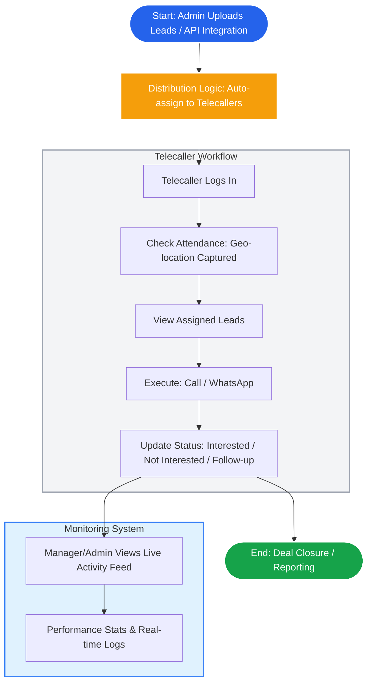

# Hanva Technologies CRM - Process Flow

## CRM Lifecycle Flowchart

## Description
1.  **Start**: Leads are entered into the system via CSV upload or API integration.
2.  **Distribution**: The system automatically assigns leads to Telecallers based on defined logic (department, availability, etc.).
3.  **Action**:
    *   Telecaller logs in.
    *   Attendance is marked with Geo-location.
    *   Telecaller sees their assigned leads.
4.  **Execution**: Telecaller performs actions (Call, WhatsApp) and updates the lead status.
5.  **Monitoring**: Managers and Admins can view a live feed of activities and performance statistics.
6.  **End**: The process concludes with deal closure or reporting.
